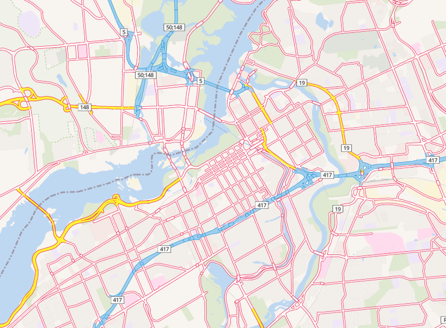

# LMID DIMT GL Style

## [Preview](https://gis.clmi-explore-icmt.ca/geoserver/www/styles/styles.html)

``` console
$ git clone https://github.com/LMID-DIMT/lmid-dimt-gl-style
```

A basemap style for Mapbox GL and Leaflet JS showcasing OpenStreetMap data. This map style was inspired by the classic Canadian road maps designed by [Lucid Maps Inc](http://www.lucidmap.ca/). This map is using the vector tile schema of [OpenMapTiles](https://github.com/openmaptiles/openmaptiles).




## /example

### Mapbox GL

Required files:
* [style.js]()
* [mapbox-gl.js](https://api.tiles.mapbox.com/mapbox-gl-js/v0.35.1/mapbox-gl.js)
* [mapbox-gl.css](https://api.tiles.mapbox.com/mapbox-gl-js/v0.35.1/mapbox-gl.css)

```html

<html>

<title>LMI OpenMapTiles</title>

<meta charset="utf-8">
<meta name="viewport" content="width=device-width, initial-scale=1">

<style>
      html, body, #map {
        width: 100%;
        height: 100%;
        margin: 0;
      }
</style>

<!-- Mapbox GL -->
<link href="https://api.tiles.mapbox.com/mapbox-gl-js/v0.35.1/mapbox-gl.css" rel="stylesheet">
<script src="https://api.tiles.mapbox.com/mapbox-gl-js/v0.35.1/mapbox-gl.js">

</script>

<div id="map"></div>

<script src="style.js"></script>

<script>

var map = new mapboxgl.Map({
    accessToken: 'no-token',
    container: 'map',
    style: style, // for French labels use: styleFr
    center: [64.83,-91.32],
    zoom: 4
}).addTo(map);

</script>
</html>

```

### Leaflet JS

Required files:
* [style.js]()
* [leaflet.js](https://unpkg.com/leaflet@1.0.3/dist/leaflet.js)
* [leaflet.css](https://unpkg.com/leaflet@1.0.3/dist/leaflet.css)
* [leaflet-mapbox-gl.js](https://unpkg.com/mapbox-gl-leaflet@0.0.3/leaflet-mapbox-gl.js)
* [mapbox-gl.js](https://api.tiles.mapbox.com/mapbox-gl-js/v0.35.1/mapbox-gl.js)
* [mapbox-gl.css](https://api.tiles.mapbox.com/mapbox-gl-js/v0.35.1/mapbox-gl.css)

```html

<html>

<title>LMI OpenMapTiles</title>

<meta charset="utf-8">
<meta name="viewport" content="width=device-width, initial-scale=1">

<style>
html, body, #map {
  width: 100%;
  height: 100%;
  margin: 0;
}
</style>

 <!-- Leaflet -->
<link rel="stylesheet" href="https://unpkg.com/leaflet@1.0.3/dist/leaflet.css">
<script src="https://unpkg.com/leaflet@1.0.3/dist/leaflet.js"></script>

 <!-- Mapbox GL -->
<link href="https://api.tiles.mapbox.com/mapbox-gl-js/v0.35.1/mapbox-gl.css" rel="stylesheet">
<script src="https://api.tiles.mapbox.com/mapbox-gl-js/v0.35.1/mapbox-gl.js"></script>

<div id="map"></div>

<script src="https://unpkg.com/mapbox-gl-leaflet@0.0.3/leaflet-mapbox-gl.js"></script>

<script src="style.js"></script>

<script>

var map = L.map('map').setView([64.83,-91.32], 4);

var lmi = L.mapboxGL({
    accessToken: 'no-token',
    style: style // for French labels use: styleFr
}).addTo(map);

</script>
</html>

```

## /fonts, /icons, /sprites

These folders include fonts, icons and sprites that are used in the LMID-DIMT GL style. They are included for your reference, but they are not needed to use our vector tile map service.

## Acknowledgements
* [OpenMapTiles](http://openmaptiles.org)
* [TileServer GL](http://tileserver.org/)
* [Leaflet JS](http://leafletjs.com)
* [Mapbox GL JS](https://www.mapbox.com/mapbox-gl-js/api/)
* [Mapbox GL Leaflet](https://github.com/mapbox/mapbox-gl-leaflet)
